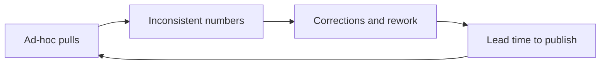
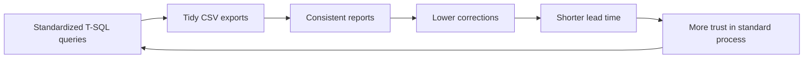
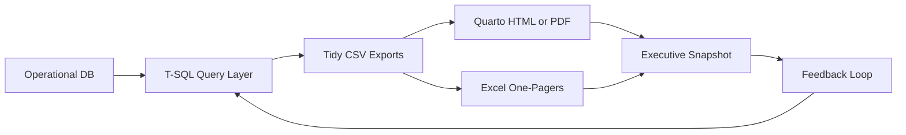

# Operational_Reporting_From_TSQL

A public-safe case study.  
Reports built on top of a clean T-SQL query layer.  
This documents the process and the work done.

**At a glance**

- Starts with repeatable queries. Ends with clear reports.  
- Uses real constraints: legacy Excel, shared drives, mixed versions.  
- Produces supervisor one-pagers and executive snapshots.  
- Uses AI to shorten timelines and improve clarity.  
- Documents what was learned, not only what shipped.

---

## Quick Tour (2 minutes)

- **Problem**: Ad-hoc spreadsheets. Inconsistent numbers. Slow turnarounds.  
- **What I built**: T-SQL query layer plus repeatable reports in Excel and Quarto.  
- **Impact**: Less manual prep. Fewer corrections. Faster briefings.  
- **How to review**: Read this README. Scan Process Flow. See Data Practices and Roadmap.  
- **Skills**: SQL Server, T-SQL, data modeling, R, Quarto, Excel, reproducible reporting.  
- **AI role**: Faster design reviews, clearer docs, quicker debugging. Human validation kept.

---

## Privacy, Confidentiality, and Ethics

This repository shares the process, not the data.  
All operational data, screenshots, and schema details are confidential.

- No protected or identifying information is posted.  
- Queries, reports, and screenshots are withheld or generalized.  
- Examples use generic terms: Client, Staff, Item, Facility.  
- Work follows least privilege and need-to-know access.  
- Methods are reproducible and auditable inside the secure environment.

> Bottom line: real results, real constraints. Public repo shows method and learning. The details stay private by design.

---

## Why You Will Not See Full Artifacts Here

- **Queries** tie to confidential schemas and field names.  
- **Reports** include sensitive operational measures and time windows.  
- **Screenshots** can expose protected context even when redacted.  
- **Interfaces** reflect internal systems.

This README documents the approach, tools, and lessons learned.  
It is a public-safe case study of how the system was built and validated.

---

## Project Overview

Goal: turn operational data into reliable, explainable reports.  
The data existed. The reporting process needed structure.

This repository explains how the reporting layer grew from the T-SQL project into a set of practical outputs.  
All content is generalized.

---

## Problem → Solution (STAR)

**Situation**: Leaders lacked trusted operational reporting.  
**Task**: Build repeatable, auditable outputs without exposing protected data.  
**Action**: Designed a T-SQL query set, tidy CSV exports, and report templates in Excel and Quarto.  
**Result**: Faster prep. Fewer corrections. Clearer accountability. Details available privately.

---

## From Queries to Reports: How the Process Evolved

1) **Define the questions**  
   What counts do leaders need daily and monthly.  
   What trends matter week to week and year to date.

2) **Build the query layer**  
   Clean joins. Consistent keys. Explicit date logic.  
   CSV exports that are tidy and predictable.

3) **Prototype reports**  
   Excel and Quarto drafts.  
   Simple charts and supervisor one-pagers.  
   Early feedback from users.

4) **Harden the outputs**  
   Standard tabs and table layouts.  
   Print-ready pages for field use.  
   Clear footnotes and definitions.

5) **Extend the process**  
   Month over month and year over year views.  
   Data quality checks. Upstream fixes.  
   Baselines for future dashboards.

Loop: Questions → Queries → Reports → Feedback → Better Queries.

---

## Applications Used

- **SQL Server** with **T-SQL** in **SSMS** for data retrieval.  
- **Excel** for layout, printing, and quick visuals.  
- **R + Quarto** for scripted HTML and PDF reports.  
- **Power BI** for exploratory visuals and checks.  
- **GitHub** for documentation and change history.

Pick the right tool for the audience. Keep logic in the queries.

---

## Data Practices

- Reproducible queries and clear data modeling.  
- Separation of raw data, logic, and presentation.  
- Parameterized date windows where useful.  
- Transparent logic that others can audit.  
- Least privilege access. No protected data in examples.

---

## Systems Thinking in Practice

I applied Systems Thinking to design reports that improve the process, not only the numbers.

**Why it mattered**

- Avoid local fixes that create bottlenecks elsewhere.  
- Make small, durable changes that reduce rework.  
- Expose feedback loops so leaders can act earlier.

**Course to practice**

| Concept | How it was used |
|---|---|
| Reinforcing vs balancing loops | Identified a reinforcing loop of ad-hoc reporting → errors → rework → delays. Built a balancing loop with standardized queries and shared definitions. |
| Delays and lagging effects | Used rolling windows and month over month views to show when procedure changes began to affect accuracy. |
| Shifting the burden | Moved effort from manual spreadsheet fixes to upstream SQL definitions and tidy exports. |
| Leverage points | Standard column order, parameterized date windows, and a one-pager layout. Small choices with large downstream impact. |
| Clear mental models | Added explicit metric definitions and footnotes so teams use the same meanings. |

**Causal structure, simplified**

Reinforcing loop: more ad-hoc pulls increase rework and delay, which increases pressure for more ad-hoc pulls.

Balancing loop: standardization reduces rework and lead time, which reinforces adoption of the standard path.

**Operational choices guided by Systems Thinking**

- Put definitions in the README and in report footnotes to reduce churn.  
- Keep logic in SQL, not in spreadsheets, so fixes apply upstream and persist.  
- Add a feedback step to each cycle, capture issues, and adjust the query layer first.  
- Prefer small experiments, for example a single unit or weekly window, then scale.

**Result, summarized**

- Less rework and faster prep.  
- Fewer disputes over definitions.  
- Earlier signal when a change is working, through run charts and rolling windows.

---

## School → Real-World: Applying Probability, Statistics, and Data Science

Coursework informs practice. Practice reinforces coursework.

**Coursework to practice**

| Course Concept | Real-World Application |
|---|---|
| Descriptive stats | Daily and monthly summaries show level and spread |
| Probability models | Expected ranges for counts per day or shift to spot outliers |
| Confidence intervals | Honest uncertainty on key rates and proportions |
| Hypothesis framing | Before vs after windows to test if accuracy improved |
| Run and control charts | Separate common-cause from special-cause variation |
| Correlation and regression | Simple checks for volume vs staffing or weekday effects |
| Time series basics | MoM and YoY context with moving averages |
| Forecasting baselines | Light forecasts for planning with clear limits |
| Data quality rules | Missingness checks and valid value lists before reporting |
| Reproducible analysis | Parameterized SQL and scripted Quarto rendering |

**Operating principles**

- Start with the question. Make assumptions explicit.  
- Prefer simple models first. Show uncertainty.  
- Separate signal from noise. Keep it reproducible.  
- Document definitions. Numbers should be explainable and defensible.

---

## Probability and Statistics in Practice

I applied probability and statistics to make reports trustworthy and useful. The goal was clear answers, with honest uncertainty.

**What I used**

- Descriptive stats: level and spread for daily and monthly metrics
- Confidence intervals: 95% intervals on key rates to avoid false certainty
- Before and after checks: simple hypothesis framing for procedure changes
- Run and control charts: separate signal from noise over time
- Expected ranges: baseline variability to flag anomalies for review
- Forecast baselines: light projections for planning, with limits stated
- Data quality rules: missingness, valid values, and duplicate checks

**How it helped**

- Leaders saw trends with context, not just one number
- Procedure changes were judged on evidence, not impressions
- Outliers triggered review, not blame
- Forecasts set expectations for staffing and workload

**Example, summarized**

- Question: Did the new procedure improve accuracy
- Method: Compare pre-change and post-change accuracy rates, show 95% CIs, plot a run chart
- Result: Sustained improvement after the change, fewer corrections, earlier signal when drift appeared

**Principles**

- Start simple, add complexity only if it improves decisions
- Make assumptions explicit and documented
- Show uncertainty and definitions next to the metric
- Keep it reproducible so results can be checked later

**Why this matters**

This project blended probability and statistics with systems thinking. It produced useful information instead of fluff. It supported operational decisions through clear reports that decision makers and budget controllers could use.

## Typical Workflow

1. Run parameterized queries for the target window.  
2. Export tidy CSV files to the reports folder.  
3. Refresh Excel workbooks or render Quarto.  
4. Print the supervisor one-pager if needed.  
5. Log feedback. Improve the query or layout next run.

Small steps. Tight loop. Better reports each cycle.

---

## AI Collaboration

This project used ChatGPT (GPT-5 Thinking) as a partner.

- **Design partner**: shaped query patterns, naming, and filters.  
- **Debugger**: spotted join mistakes and date edge cases.  
- **Instructor**: explained T-SQL topics on keys, temp tables, and aggregates.  
- **Editor**: tightened documentation and report notes.

All final testing and sign-off were human.  
AI reduced trial and error. It improved structure.  
It kept focus on the business question.

---

## Process Flow

  
<strong>High-level diagram</strong>

---

## Impact

- Less manual prep time per cycle.  
- Fewer corrections after standardization.  
- Clear audit trail for numbers and definitions.  
- Faster briefings using the same data definitions.

Add numbers when possible. Even rough ranges help.

---

## What I Learned

- How to map vague asks into testable outputs.  
- Why tidy exports save hours downstream.  
- How to write for users who print and annotate.  
- How to document definitions so numbers are defensible.  
- How to use AI to think faster without skipping understanding.

---

## Future Options

- **Synthetic dataset** that mirrors schema shape for demos and CI checks.  
- **Control charts** for process stability.  
- **Forecast baselines** for volume planning.  
- **CI** on CSV schema and null rules.  
- **Accessibility** with print-safe colors and alt text.

---

## Changelog

- 2025-11-26: Added Probability and Statistics section and updated rationale.

- 2025-11-25: Initial public-safe documentation of the process.

---

## Ethics Statement

This project respects privacy, legal policy, and organizational standards.  
Public materials focus on method and professional growth.  
Operational outputs remain inside the secure environment.
